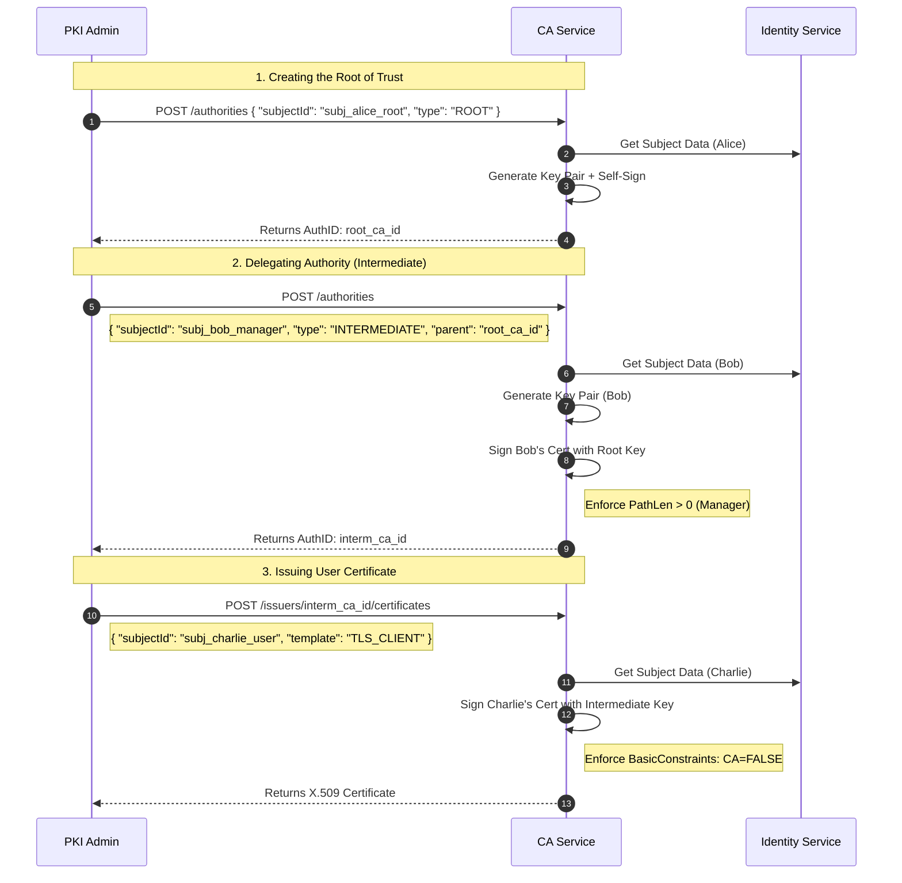
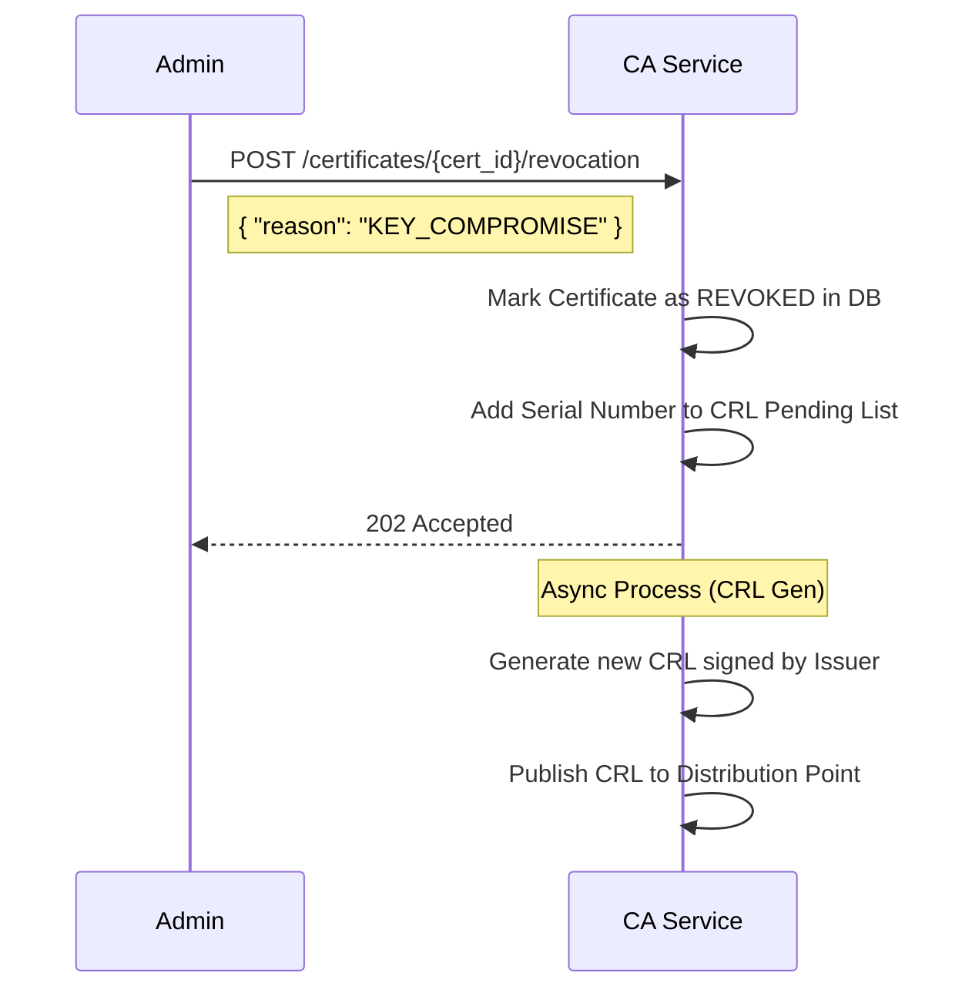

# Certification Authority (CA) Service API Documentation

**Responsibility:** Manages the lifecycle of Cryptographic Keys and X.509 Certificates. It trusts the **Identity Service** for subject data but enforces all cryptographic policies (RFC 5280, Key Usage, Path Length).

---

## 1. Workflows & Actors

*   **Root Authority**: A Subject elevated to be the Trust Anchor.
*   **Intermediate Authority**: A Subject elevated to issue certificates, signed by a Root or another Intermediate.
*   **End-Entity**: A Subject that holds a certificate for usage (TLS, Email, Signing) but cannot sign other certificates.

### 1.1. Hierarchy Creation Sequence



### 1.2. Revocation Sequence



---

## 2. Authority Management (CAs)

Transform a `Subject` (from Identity Service) into a **Certification Authority**. This involves generating a key pair and either self-signing (Root) or requesting a signature (Intermediate).

### 2.1. Promote Subject to Authority
Creates a new CA.

*   **POST** `/api/v1/authorities`

**Request (Scenario: Creating an Intermediate Issuer):**
```json
{
  "subjectId": "771f9511-f30c-52e5-b827-557766551111", // UUID of Maria Silva
  "type": "INTERMEDIATE", // ROOT, INTERMEDIATE
  "parentAuthorityId": "110e8400-e29b-41d4-a716-446655440000", // The Root CA ID
  "keySpec": {
    "algorithm": "RSA",
    "size": 4096
  },
  "policy": {
    "validityYears": 5,
    "pathLenConstraint": 0, // CRITICAL: 0 means Maria CANNOT create sub-CAs.
    "crlDistributionPoint": "http://pki.irondome.io/crl/root.crl",
    "ocspResponderUrl": "http://pki.irondome.io/ocsp"
  }
}
```

**Response (201 Created):**
```json
{
  "id": "992a0622-d41d-63f6-c938-668877662222",
  "subjectId": "771f9511-f30c-52e5-b827-557766551111",
  "type": "INTERMEDIATE",
  "status": "ACTIVE",
  "serialNumber": "4A1B2C3D4E5F6G7H",
  "thumbprint": "A1B2C3D4...",
  "notBefore": "2026-01-31T14:40:00Z",
  "notAfter": "2031-01-31T14:40:00Z",
  "hierarchy": {
    "isRoot": false,
    "pathLenConstraint": 0
  }
}
```

### 2.2. Get Authority Chain
Retrieves the full trust chain (P7B or ordered list) for installation.

*   **GET** `/api/v1/authorities/{id}/chain`

---

## 3. Certificate Issuance (End-Entities)

Issues certificates for non-authority subjects (Web Servers, Email, Signatures).

### 3.1. Issue Certificate
*   **POST** `/api/v1/issuers/{authorityId}/certificates`

**Request:**
```json
{
  "subjectId": "882f9511-f30c-52e5-b827-557766553333", // UUID of "Web Server 01"
  "template": "TLS_SERVER", // TLS_SERVER, TLS_CLIENT, CODE_SIGNING
  "validityDays": 365,
  "san": { // Subject Alternative Names
    "dnsNames": ["www.irondome.io", "api.irondome.io"],
    "ipAddresses": ["192.168.1.10"]
  }
}
```

**Response (200 OK):**
```json
{
  "id": "123f9511-f30c-52e5-b827-557766559999",
  "serialNumber": "9988776655443322",
  "certificateContent": "-----BEGIN CERTIFICATE-----\nMIIDAzCCAfugAwIBAgIQ...\n-----END CERTIFICATE-----",
  "format": "PEM"
}
```

---

## 4. Revocation (CRL)

### 4.1. Revoke Certificate
*   **POST** `/api/v1/certificates/{certId}/revocation`

**Request:**
```json
{
  "reason": "KEY_COMPROMISE", // UNSPECIFIED, KEY_COMPROMISE, CA_COMPROMISE, AFFILIATION_CHANGED, SUPERSEDED, CESSATION_OF_OPERATION
  "comment": "Server was decommissioned and hard drive was not wiped."
}
```

### 4.2. Download CRL
*   **GET** `/api/v1/issuers/{authorityId}/crl`
    *   Returns the raw binary DER or PEM CRL file.

