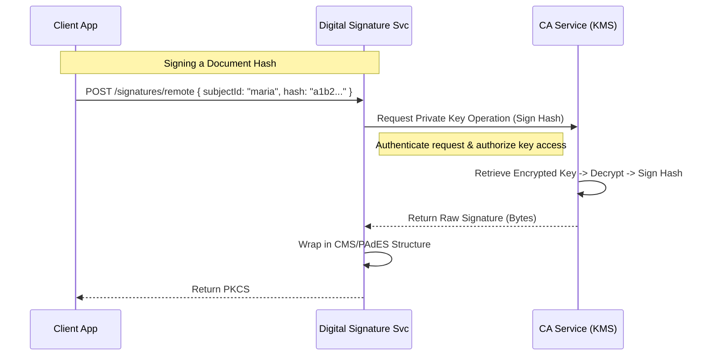
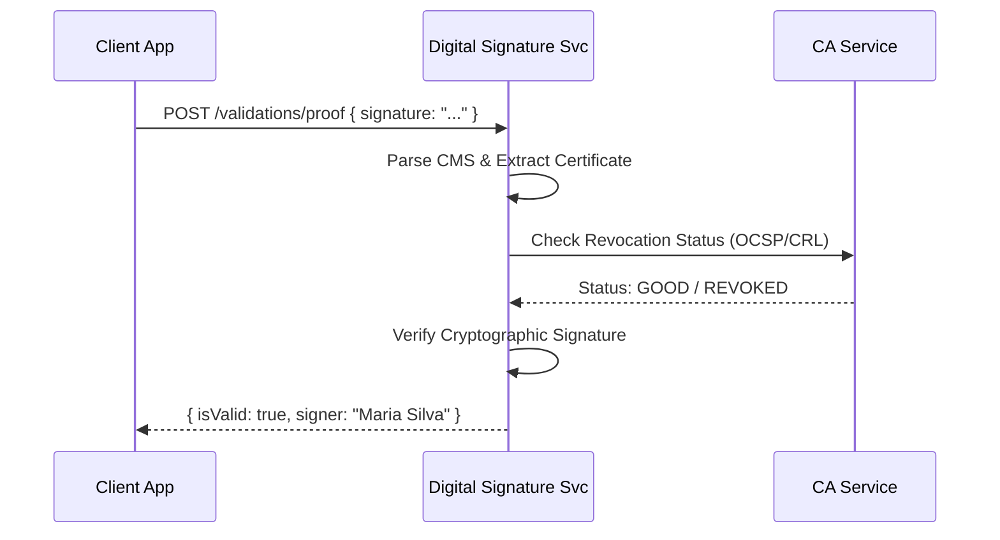

# Digital Signature Service API Documentation

**Responsibility:** Provides high-level business abstractions for electronic signatures. It consumes the **Identity** and **CA Services** to perform operations without exposing complexity (keys, algorithms) to the client application.

---

## 1. Workflows

### 1.1. Remote Signing (Server-Side)
The client application wants to sign a PDF hash. It doesn't have the user's private key; IronDome manages it.



### 1.2. Signature Validation
Verifying an incoming signed document against the PKI trust anchors.



---

## 2. Remote Signing (Server-Side)

In this mode, the Private Key is held securely by IronDome (HSM or Encrypted DB). The client sends the data (hash), and the service signs it.

### 2.1. Sign Document (Hash)
Signs a document hash using a stored identity key.

*   **POST** `/api/v1/signatures/remote`

**Request:**
```json
{
  "signerSubjectId": "771f9511-f30c-52e5-b827-557766551111", // UUID of Maria Silva
  "documentHash": "e3b0c44298fc1c149afbf4c8996fb92427ae41e4649b934ca495991b7852b855", // SHA-256 of the PDF/XML
  "hashAlgorithm": "SHA256",
  "signatureProfile": "PAdES-B", // PAdES (PDF), XAdES (XML), CAdES (CMS), RAW
  "options": {
    "includeTimestamp": true, // Requires TSA configuration
    "detached": true
  }
}
```

**Response (200 OK):**
```json
{
  "signature": "MIAGCSqGSIb3DQEHAqCAMIACAQExDzANBglghkgBZ...",
  "format": "CMS",
  "certificateId": "123f9511-f30c-52e5-b827-557766559999", // The cert used
  "timestampToken": "..." // If requested
}
```

---

## 3. Signature Validation

Validates signatures generated either by IronDome or external PKIs.

### 3.1. Validate Signature
*   **POST** `/api/v1/validations/proof`

**Request:**
```json
{
  "fileContent": "base64-encoded-file...", // OR
  "digest": "sha256-hash...",
  "signature": "base64-encoded-signature...", // For detached signatures
  "policy": {
    "checkRevocation": true, // Checks CRL/OCSP
    "trustedRoots": ["IronDome Root CA", "ICP-Brasil v5"] // Optional filter
  }
}
```

**Response (200 OK):**
```json
{
  "isValid": true,
  "validationTime": "2026-01-31T15:00:00Z",
  "signer": {
    "subject": "CN=Maria Silva, O=IronDome Corp, C=BR",
    "issuer": "CN=IronDome Intermediate CA",
    "serialNumber": "9988776655443322"
  },
  "checks": {
    "integrity": "PASSED",
    "trustChain": "PASSED",
    "revocation": "PASSED"
  }
}
```