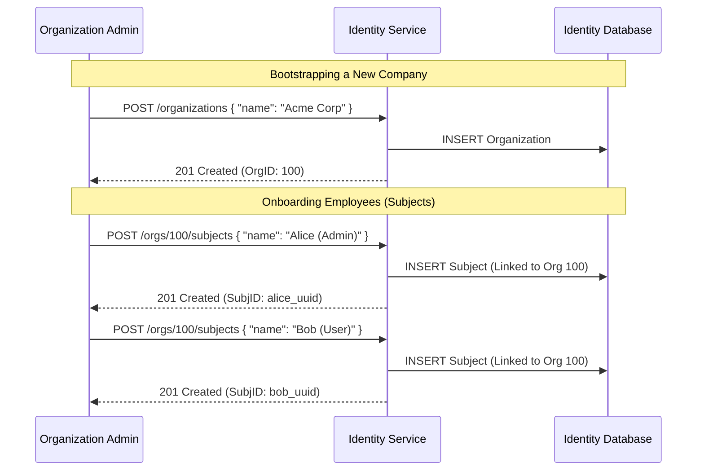

# Identity Service API Documentation

**Responsibility:** Manages the lifecycle of legal and logical entities ("Who is Who"). It serves as the single source of truth for Distinguished Name (DN) attributes used in certificates. It is decoupled from cryptographic operations.

---

## 1. Actors & Roles
*   **Organization**: A legal entity (e.g., "IronDome Corp") that acts as the root boundary for subjects.
*   **Subject**: An individual actor (Person, System, Device) belonging to an Organization.
    *   **Note**: At this layer, a Subject is just a database record. Whether they become a Root CA, Intermediate CA, or End-User is determined later by the **CA Service**.

### 1.1. Entity Relationship Diagram



---

## 2. Organizations

Represents a legal boundaries, typically a company or a root entity.

### 2.1. Create Organization
Registers a new legal entity.

*   **POST** `/api/v1/organizations`

**Request:**
```json
{
  "legalName": "IronDome Corp",
  "tradeName": "IronDome Security",
  "taxId": "12.345.678/0001-90",
  "country": "BR",
  "address": {
    "street": "Tech Park Ave",
    "number": "100",
    "city": "Sao Paulo",
    "state": "SP",
    "zipCode": "01000-000"
  },
  "contactEmail": "admin@irondome.io"
}
```

**Response (201 Created):**
```json
{
  "id": "550e8400-e29b-41d4-a716-446655440000",
  "legalName": "IronDome Corp",
  "status": "ACTIVE",
  "createdAt": "2026-01-31T14:30:00Z"
}
```

### 2.2. Get Organization
*   **GET** `/api/v1/organizations/{id}`

---

## 3. Subjects (Actors)

Represents an actor within an organization. This can be a Person, a System (Service Account), or a Device (IoT). This entity will later become the "Subject" of an X.509 Certificate.

### 3.1. Create Subject
Registers a new actor.

*   **POST** `/api/v1/organizations/{orgId}/subjects`

**Request:**
```json
{
  "commonName": "Maria Silva",
  "email": "maria.silva@irondome.io",
  "type": "PERSON", // PERSON, SYSTEM, DEVICE
  "department": "Engineering",
  "jobTitle": "DevOps Lead",
  "externalReferenceId": "AD-8832-11" // Link to Active Directory or HR System
}
```

**Response (201 Created):**
```json
{
  "id": "771f9511-f30c-52e5-b827-557766551111",
  "organizationId": "550e8400-e29b-41d4-a716-446655440000",
  "commonName": "Maria Silva",
  "distinguishedNameAttributes": {
    "CN": "Maria Silva",
    "O": "IronDome Corp",
    "OU": "Engineering",
    "C": "BR"
  },
  "status": "ACTIVE",
  "createdAt": "2026-01-31T14:35:00Z"
}
```

### 3.2. Get Subject Details
*   **GET** `/api/v1/subjects/{id}`

### 3.3. Search Subjects
Useful for auto-discovery when issuing certificates.

*   **GET** `/api/v1/subjects?email=maria.silva@irondome.io`