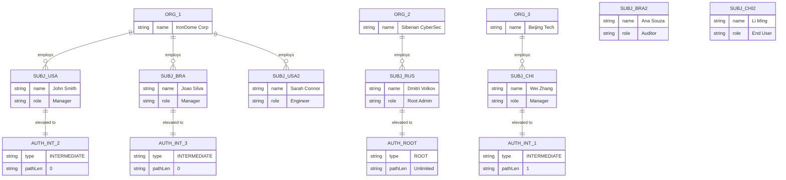
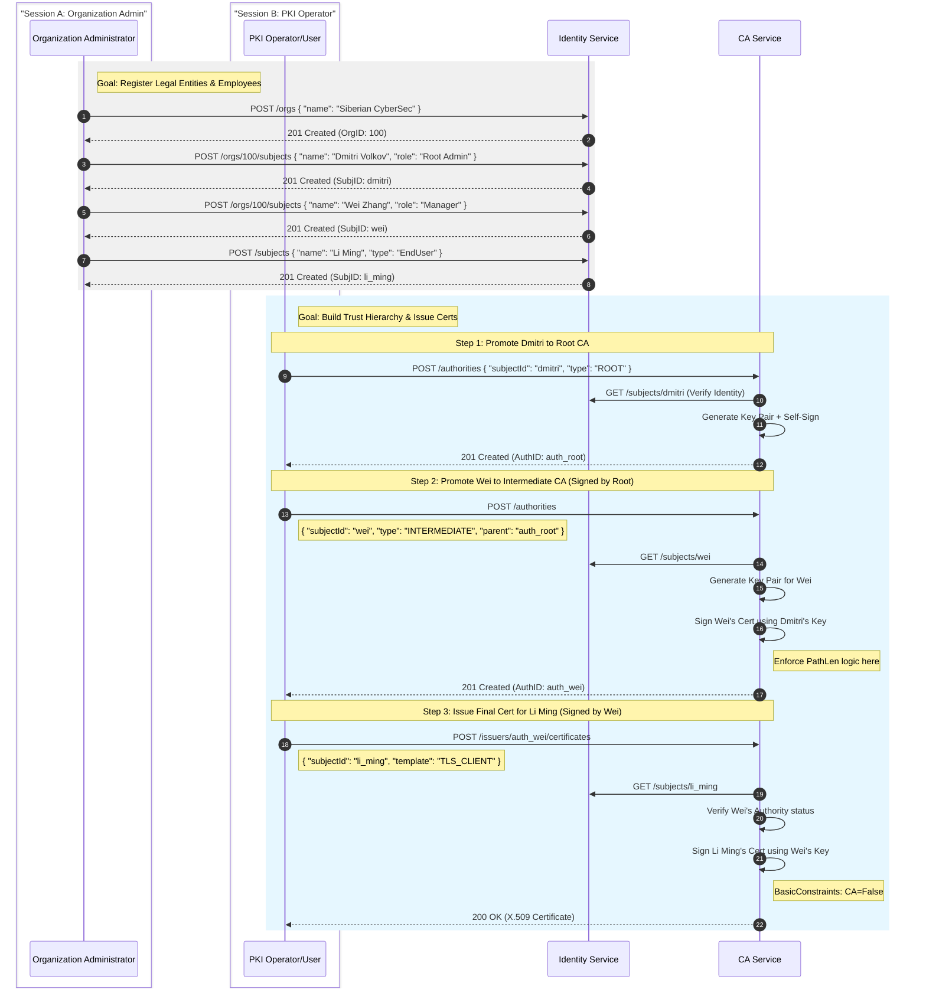

# IronDome System Concepts

This document outlines the core conceptual model for the **IronDome PKI** ecosystem. It defines the separation of concerns between legal entities, actors, and cryptographic capabilities, adhering to **RFC 5280**.

## 1. Core Data Model

To provide flexibility and clear responsibility boundaries, the system decouples "Identity" (Who is this?) from "Capability" (What can this do?).

### 1.1. Organization
Represents the **legal or logical container** for all operations. It provides the context for the `O` (Organization) and `C` (Country) fields in a Distinguished Name (DN).

*   **Role**: Legal boundary, billing entity, root of trust context.
*   **Attributes**: Legal Name, Tax ID, Country.

### 1.2. Subject (Identity)
Represents a distinct **actor** within an Organization. Formerly referred to as "UserProfile".
A `Subject` is the entity that *owns* a private key and is the *subject* of a certificate.

*   **Role**: The unique identity. Source of truth for `CN` (Common Name) and `OU` (Organizational Unit).
*   **Types**:
    *   **Person**: A human user (e.g., "Maria Silva").
    *   **System**: A service account or daemon.
    *   **Device**: IoT device or hardware component.

### 1.3. Authority (Capability)
Represents the **elevation of privilege** for a specific `Subject`.
A `Subject` by itself is just a user. To act as a Certification Authority (CA), an `Authority` resource must be created and linked to that Subject.

*   **Role**: Defines the cryptographic powers, issuance policies, and position in the trust hierarchy.
*   **Key Concept**: A Subject can exist without being an Authority. An Authority cannot exist without a Subject.

---

## 2. Diagrammatic Overview

### 2.1. Entity Relationships (Organizations & Subjects)

The following diagram illustrates the relationship between Organizations, Subjects, and the "Authority" overlay. Note that "End Users" are simply Subjects without an associated Authority.

### 2.2. Operation Sequence: From Zero to Certificate

This sequence separates the roles of the **Organization Admin** (who bootstraps the entities) and the **PKI Operator** (who manages the certificates).

---

## 3. Authority Roles & Privilege Elevation

When a Subject is promoted to an Authority, specific cryptographic constraints are applied based on the desired role.

### 3.1. Root Authority
*   **Definition**: A Trust Anchor. The Subject holds a self-signed certificate.
*   **Capabilities**: Can issue certificates to anyone (other CAs or End-Entities).
*   **Configuration**: Unlimited path length (usually).

### 3.2. Intermediate Authority
*   **Definition**: A CA whose trust is derived from a parent (Root or another Intermediate).
*   **Capabilities**: Depends strictly on the **Path Length Constraint** assigned by the parent.

---

## 4. Cryptographic Enforcement (RFC 5280)

IronDome strictly enforces hierarchy rules using the X.509 **Basic Constraints (OID 2.5.29.19)** extension. This ensures that business rules defined in the `Authority` resource are respected by any standard PKI client globally.

### 4.1. The "PathLen" Rule

The power of an Intermediate CA is controlled by the `pathLenConstraint` field in its certificate.

#### Scenario A: Intermediate Manager (Delegated CA)
*   **Goal**: Maria Silva (Regional Manager) needs to create sub-CAs for her departments.
*   **Policy**: `pathLen > 0` (e.g., 1).
*   **Result**: Maria allows the creation of a chain: `Root -> Maria (Len=1) -> Dept IT (Len=0) -> WebServer`.
*   **Cryptographic Enforcement**: The certificate issued to Maria will have `BasicConstraints: cA=TRUE, pathLen=1`.

#### Scenario B: Intermediate Issuer (Terminal CA)
*   **Goal**: The "Dept IT" CA needs to issue SSL certificates but **must not** be able to create new CAs.
*   **Policy**: `pathLen = 0`.
*   **Result**: The chain stops here regarding authority. `Dept IT` can only sign End-Entity certificates.
*   **Cryptographic Enforcement**: The certificate issued to Dept IT will have `BasicConstraints: cA=TRUE, pathLen=0`.

---

## 5. Policy Matrix Summary

| Role | Resource Type | BasicConstraints `cA` | `pathLenConstraint` | Can Sign CAs? | Can Sign End-Entities? |
| :--- | :--- | :--- | :--- | :--- | :--- |
| **Root** | Authority | `TRUE` | `None` / `High` | Yes | Yes |
| **Manager** | Authority | `TRUE` | `> 0` | Yes | Yes |
| **Issuer** | Authority | `TRUE` | `0` | **NO** | Yes |
| **User/Device**| Subject (No Auth) | `FALSE` | `None` | No | No |
